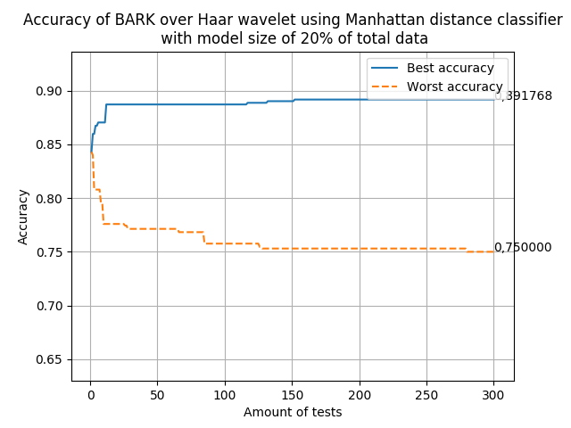
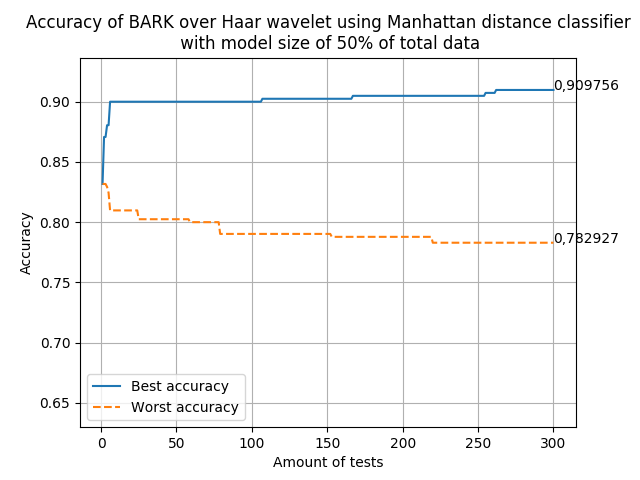

# Caracterização de voice spoofing para fins de verificação de locutores com base na transformada wavelet e na análise paraconsistente de características
Characterization of voice spoofing announcers verification based on the wavelet transform and paraconsistent analysis of characteristics
[English Version](#english-version)

# Universidade do estado de São Paulo - UNESP

## Resumo

Sistemas de autenticação de usuário por voz e o processo de 
falseamento usando voice spoofing é o tema de estudo que se 
pretende explorar. Um sistema de reconhecimento  de voz idealmente 
não deve se deixar enganar por, como exemplo, uma voz gravada, 
neste trabalho serão apresentados métodos que visam a construção 
de métodos que reconheçam esse ataque.

## Resultados

### Usando um classificador por distância Euclidiano 
 
 
 
 
 

### Usando um classificador por distância Manhattan 
 
 
 
 
 

### Usando um classificador de Máquina de vetores de suporte 
 
 
 
 
 

# English Version

# São Paulo State university - UNESP

## Abstract
Voice user authentication systems and the spoofing process 
using voice spoofing is the subject of study that we intend 
to explore. A voice recognition system ideally should not be 
fooled by, for example, a recorded voice, in this work some
ways will be presented that aim to build methods that recognize 
this attack.

## Results
### Using Euclidian distance classifier 
 
 
 
 
 

### Using Manhattan distance classifier 
 
 
 
 
 

### Using Support vector machine classifier 
 
 
 
 
 
